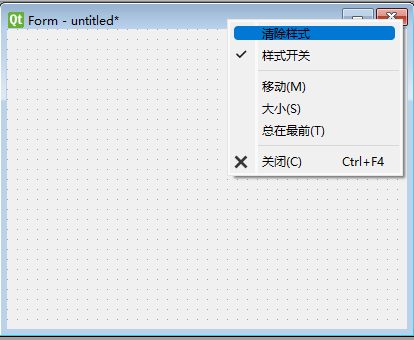

# QSSEditor

QSS Editor Proxy For Qt Designer

# QQ Group

[PyQt 学习](https://jq.qq.com/?_wv=1027&k=5QVVEdF)

## Download

[Release 下载](https://github.com/PyQt5/QSSEditor/releases)

## Description

1. Download and unzip (下载和解压文件)
2. copy `bin` and `plugins` to Qt Location (拷贝文件到Qt安装目录)
3. start Designer (启动设计师)
4. use `vscode` to edit qss file and apply style (使用vscode编辑qss文件并应用样式)

## Configure

Profile default path: (默认配置文件路径)

- Windows: C:/Users/USER/AppData/Local/DesignerProxy/DesignerProxy.ini
- Linux: ~/.local/share/DesignerProxy/DesignerProxy.ini
- MacOS: ~/Library/Application Support/DesignerProxy/DesignerProxy.ini

Note: `DesignerProxy.db` is keywords.

Configuration content is:

```ini
[General]
port=61052
level=0
host=0.0.0.0

```

level (日志级别): 0=trace, 1=debug, 2=info, 3=warn, 4=err, 5=critical, 6=off

## Preview



